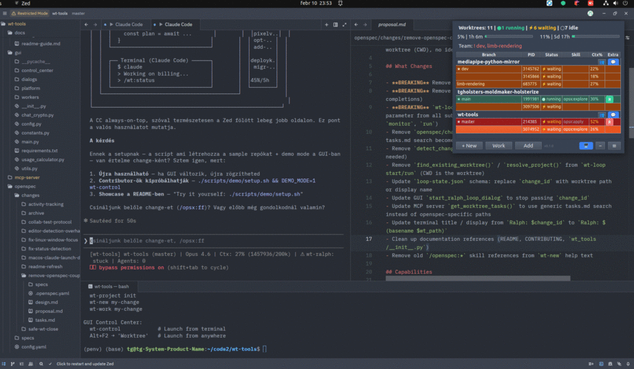
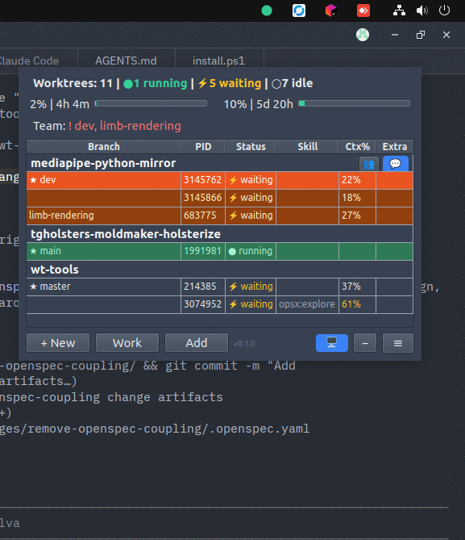
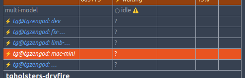

# wt-tools

A toolkit for managing parallel AI agent development with git worktrees, a real-time GUI, and spec-driven workflows.

> **Latest update:** 2026-02-20

---

## Overview

I built wt-tools because I was running Claude Code agents across multiple projects simultaneously and kept losing track. Which agent is waiting for input? Which one finished? Where was that terminal tab? I was manually Alt-Tabbing between windows, scanning terminals to figure out what's happening, and losing time to context switches that had nothing to do with the actual work. wt-tools makes all of that disappear — one small window shows everything, and you stay focused on what matters.

The **Control Center** is a compact, always-on-top GUI that shows every worktree and agent across all your projects in real-time. You see at a glance which agents are running, which are waiting for you (blinking row — click to jump straight there), and how much API capacity you have left (hourly and daily burn rate). Double-click any row to open the editor — if it's already open, it focuses the window. Need a new worktree? Click "+ New", pick the project, name it, and you're working. Everything also has a CLI command and a Claude Code slash command, so you never leave the agent to manage worktrees.

Beyond the basics: the **Ralph Loop** runs agents autonomously through task lists, **Team Sync** coordinates multiple machines through a git branch (no server needed), the **MCP Server** lets agents see each other's progress, and **Developer Memory** gives agents persistent, cross-session recall — decisions, learnings, and context accumulate across sessions so future agents don't start from zero (synthetic benchmarks show +34% convention compliance improvement).

wt-tools is a modular collection — cherry-pick what's useful to you. The GUI is optional: CLI tools, Claude Code skills (`/wt:new`, `/wt:merge`, etc.), Developer Memory, and the MCP server all work independently from the command line. You can use just the skills, just memory, or the full stack. The project is useful today — AI tooling evolves fast and something may replace it eventually, but right now it fills a real gap.



*Compact, always-on-top, draggable anywhere on screen. Multiple color themes including transparent mode. Takes up minimal space but keeps everything visible — surprisingly pleasant to use day-to-day.*



---

## Platform & Editor Support

| Platform / Tool | Status | Notes |
|-----------------|--------|-------|
| **Linux** | Primary | Tested on Ubuntu 22.04+ |
| **macOS** | Supported | Some platform-specific workarounds (see Known Issues) |
| **Windows** | Not supported | Platform stubs exist but untested |
| **Zed** | Primary editor | Best tested, recommended |
| **VS Code** | Basic support | Editor detection works, less tested |
| **Cursor / Windsurf** | Basic support | Configurable via `wt-config editor set` |
| **Claude Code** | Integrated | Auto-launch, MCP server, skill hooks |

This is a solo-developer project and I have limited resources for cross-platform testing. I'm counting on the community to help expand platform and editor support — please report issues, submit fixes, and forgive rough edges. Fixes land daily.

---

## How It Works

### Architecture

wt-tools has three layers: **shell scripts** (`bin/wt-*`) for worktree lifecycle, a **PySide6 GUI** for real-time monitoring, and an **MCP server** that connects Claude Code agents to the system. Everything is file-based — no daemon, no database, no external service.

```
┌─────────────────────────────────────────────────────────┐
│                   Control Center GUI                     │
│  PySide6 · always-on-top · light/dark/high-contrast     │
│  ┌─────────────────────────────────────────────────────┐ │
│  │  Status: 5 worktrees | 2 running | 1 waiting       │ │
│  │  Usage:  4.2h/5h (85%) hourly  |  3.1d/7d daily    │ │
│  ├─────────────────────────────────────────────────────┤ │
│  │  Project  │ Branch      │ Status   │ Ctx%  │ Skill  │ │
│  │  my-app   │ add-auth    │ running  │ 45%   │ apply  │ │
│  │           │ fix-login   │ waiting  │ 80%   │        │ │
│  │  my-lib   │ refactor    │ idle     │       │        │ │
│  └─────────────────────────────────────────────────────┘ │
└────────────┬──────────────────────┬─────────────────────┘
             │                      │
             ▼                      ▼
  ┌────────────────────┐  ┌──────────────────┐
  │   CLI Tools (bash) │  │  MCP Server (py) │
  │   wt-new/work/list │  │  list_worktrees  │
  │   wt-loop (Ralph)  │  │  get_ralph_status│
  │   wt-control-sync  │  │  get_team_status │
  └────────┬───────────┘  └────────┬─────────┘
           │                       │
           ▼                       ▼
  ┌──────────────────────────────────────────┐
  │  Git worktrees + wt-control branch       │
  │  (file-based state, git for team sync)   │
  └──────────────────────────────────────────┘
```

### Technologies

| Component | Technology | Why |
|-----------|------------|-----|
| CLI tools | Bash | Zero dependencies, works everywhere, fast |
| GUI | Python + PySide6 (Qt) | Native look, always-on-top, system tray, cross-platform |
| MCP server | Python | Exposes worktree/agent data to Claude Code |
| State | JSON files + git | No database — `wt-status` reads `/proc`, agent PIDs, git state |
| Team sync | Git branch (`wt-control`) | No server — machines push/pull member status via git |
| Encryption | NaCl Box (libsodium) | End-to-end encrypted chat between team members |

### What the GUI shows you

- **Agent status per worktree**: running / waiting / idle — with the active Claude Code skill name
- **Context usage**: how full each agent's context window is (%)
- **API burn rate**: hourly and daily token usage with visual bars — know when to slow down
- **Ralph Loop progress**: iteration count and task completion for autonomous runs
- **Team members**: what other machines/agents are working on (if Team Sync is enabled)

Double-click a row → opens editor + focuses the window. Blinking red row → agent is waiting for you. Right-click → context menu with merge, close, start Ralph loop, and more.

---

## Quick Start

```bash
# 1. Install
git clone https://github.com/tatargabor/wt-tools.git
cd wt-tools && ./install.sh

# 2. Register your project (deploys hooks, commands, and skills to .claude/)
cd ~/my-project && wt-project init

# 3. Launch the Control Center
wt-control

# 4. Create a worktree (GUI: "+ New" button, or CLI)
wt-new add-user-auth

# 5. Open it — editor + Claude Code launch automatically
wt-work add-user-auth
```

---

## Features

### Control Center GUI

Always-on-top PySide6 window showing all worktrees and agent status. Double-click to open a worktree, right-click for context menu. Includes API usage burn rate display, system tray integration, and light/dark/high-contrast themes.

### CLI Tools

Full set of shell commands for worktree lifecycle, project management, editor configuration, and team sync. See [CLI Reference](#cli-reference) below.

### Ralph Loop

Autonomous agent execution — runs Claude Code in iterations, checking task completion between runs. Start with `wt-loop start`, monitor with `wt-loop monitor`.

### Team Sync & Messaging (Experimental)

Cross-machine collaboration **without a central server** — using a `wt-control` git branch for team and machine-level coordination. Each machine syncs agent status automatically. Includes encrypted chat (`wt-control-chat`) and directed agent-to-agent messaging (`/wt:msg`). Note: Claude Code's Teams feature does not replace this — wt-tools team sync operates at the agent level, enabling different remote machines, users, or local agents to coordinate at a higher level. See [docs/agent-messaging.md](docs/agent-messaging.md).

> **Traffic note:** `wt-control-sync` runs git fetch+push on every sync cycle. The default interval is 2 minutes (`sync_interval_ms: 120000`). Lower intervals increase GitHub API traffic — at 15 seconds, that's ~480 git operations/hour per machine. Adjust in Settings → Team Sync interval. For most teams, 2 minutes is a good balance between freshness and API usage.

### Developer Memory (Experimental)

Per-project cognitive memory powered by [shodh-memory](https://github.com/varun29ankuS/shodh-memory). Agents save decisions, learnings, and context as they work — future agents in different sessions recall relevant past experience before starting. The result: agents that learn from past mistakes, remember architectural decisions, and don't repeat work that's already been done.

**Concrete examples of what this enables:**
- An agent saves that RocksDB crashes without file locking → months later, another agent avoids the same mistake
- When starting a new change with `/opsx:new`, memory hooks recall past decisions about the same topic automatically
- During implementation, the agent recognizes and saves non-obvious constraints you share ("always use absolute imports here")

**How to use it:**
- **CLI**: `wt-memory remember` to save (auto-tagged with branch), `wt-memory recall` to search (modes: semantic, temporal, hybrid, causal, associative; branch-boosted), `wt-memory forget` to clean up, `wt-memory context` for summaries, `wt-memory export/import` to transfer, `wt-memory sync` for git-based team sharing
- **GUI**: Browse memories via the [M] button — opens with a context summary, toggle to paginated list with "Show All", search semantically, save notes with "Remember Note", export/import with buttons
- **OpenSpec hooks**: Automatic recall/remember across all 8 skill phases — agent insights captured across the entire lifecycle
- **Ambient**: Agents recognize and save knowledge during any conversation, not just OpenSpec workflows
- **Requires**: `pip install shodh-memory` — gracefully degrades if not installed (all commands silently no-op)

**OpenSpec memory hook coverage:**

| Skill | Recall | User Save | Agent Reflect |
|-------|--------|-----------|---------------|
| new | hybrid | — | — |
| continue | hybrid+tags | mid-flow | session end |
| ff | hybrid+tags | mid-flow | session end |
| explore | hybrid | mid-flow | session end |
| apply | hybrid+tags | mid-flow | Step 7 |
| verify | hybrid+tags | — | post-verify |
| sync-specs | — | — | on merge |
| archive | — | — | on archive |

**Metrics & benchmarking:**
- `wt-memory metrics` — TUI report showing injection counts, token usage, relevance distribution, citation rate
- `wt-memory dashboard` — interactive HTML dashboard with charts (token burn, relevance trend, layer breakdown)
- **Synthetic benchmark (MemoryProbe)**: +34% weighted convention compliance improvement across 2 independent runs (SYN-05, SYN-06). Memory-enabled agents use 20% fewer tokens by avoiding re-discovery of known conventions
- **Real-world benchmark (CraftBazaar v6)**: no measurable delta yet — test infrastructure gaps (import-only checks, no behavioral verification) mask potential benefits. Stronger tests planned for v7

See [docs/developer-memory.md](docs/developer-memory.md) for the full guide with use cases, OpenSpec integration details, and CLI reference.

### MCP Server

Exposes worktree and Ralph loop status to Claude Code via Model Context Protocol. Auto-configured by the installer.

---

## Installation

### Prerequisites

| Requirement | Check | Purpose |
|-------------|-------|---------|
| **Git** | `git --version` | Worktree management |
| **Python 3.10+** | `python3 --version` | GUI and MCP server |
| **jq** | `jq --version` | JSON processing in shell scripts |
| **Node.js** | `node --version` | Claude Code CLI |

### Install

```bash
git clone https://github.com/tatargabor/wt-tools.git
cd wt-tools
./install.sh
```

The installer symlinks all `wt-*` commands to `~/.local/bin`, sets up shell completions, configures the MCP server, and deploys Claude Code hooks.

### GUI Dependencies

```bash
pip install PySide6 cloudscraper browser_cookie3
```

### Linux: Qt Plugin Path

If you use conda or a non-system Python, set the Qt plugin path:

```bash
QT_PLUGIN_PATH="$(python -c 'import PySide6; print(PySide6.__path__[0])')/Qt/plugins" wt-control
```

---

## CLI Reference

### Worktree Management

| Command | Description |
|---------|-------------|
| `wt-new <change-id>` | Create new worktree + branch |
| `wt-work <change-id>` | Open worktree in editor + Claude Code |
| `wt-close <change-id>` | Close worktree (removes directory and branch) |
| `wt-merge <change-id>` | Merge worktree branch back to main |
| `wt-add [path]` | Add existing repo or worktree to wt-tools |
| `wt-list` | List all active worktrees |
| `wt-status` | JSON status of all worktrees and agents |
| `wt-focus <change-id>` | Focus editor window for a worktree |

### Project Management

| Command | Description |
|---------|-------------|
| `wt-project init` | Register project + deploy hooks, commands, and skills to `.claude/` (re-run to update) |
| `wt-project list` | List registered projects |
| `wt-project default <name>` | Set default project |

### Ralph Loop

| Command | Description |
|---------|-------------|
| `wt-loop start [change-id]` | Start autonomous Claude Code loop |
| `wt-loop stop [change-id]` | Stop running loop |
| `wt-loop status [change-id]` | Show loop status |
| `wt-loop list` | List all active loops |
| `wt-loop history [change-id]` | Show iteration history |
| `wt-loop monitor [change-id]` | Watch loop progress live |

### Team & Sync

| Command | Description |
|---------|-------------|
| `wt-control` | Launch Control Center GUI |
| `wt-control-init` | Initialize wt-control team sync branch |
| `wt-control-sync` | Sync member status (pull/push/compact) |
| `wt-control-chat send <to> <msg>` | Send encrypted message |
| `wt-control-chat read` | Read received messages |

### Developer Memory

| Command | Description |
|---------|-------------|
| `wt-memory health` | Check if shodh-memory is available |
| `wt-memory remember --type TYPE` | Save a memory (reads content from stdin) |
| `wt-memory recall "query" [--mode MODE] [--tags t1,t2]` | Semantic search with recall modes and tag filtering |
| `wt-memory list [--type TYPE] [--limit N]` | List memories with optional filters (JSON) |
| `wt-memory forget <id>` | Delete a single memory by ID |
| `wt-memory forget --all --confirm` | Delete all memories (requires --confirm) |
| `wt-memory forget --older-than <days>` | Delete memories older than N days |
| `wt-memory forget --tags <t1,t2>` | Delete memories matching tags |
| `wt-memory context [topic]` | Condensed summary by category |
| `wt-memory brain` | 3-tier memory visualization |
| `wt-memory get <id>` | Get a single memory by ID |
| `wt-memory export [--output FILE]` | Export all memories to JSON (stdout or file) |
| `wt-memory import FILE [--dry-run]` | Import memories from JSON (skip duplicates) |
| `wt-memory sync` | Push + pull memories via git remote |
| `wt-memory sync push` | Push memories to shared team branch |
| `wt-memory sync pull` | Pull memories from shared team branch |
| `wt-memory sync status` | Show sync status (local vs remote counts) |
| `wt-memory proactive` | Generate proactive context for current session |
| `wt-memory stats` | Show memory statistics (counts, types, noise ratio) |
| `wt-memory cleanup` | Delete low-importance and noisy memories |
| `wt-memory migrate` | Run pending memory storage migrations |
| `wt-memory migrate --status` | Show migration history |
| `wt-memory repair` | Repair index integrity |
| `wt-memory audit [--threshold N] [--json]` | Report duplicate clusters and redundancy stats |
| `wt-memory dedup [--threshold N] [--dry-run] [--interactive]` | Remove duplicate memories, keeping best per cluster |
| `wt-memory status [--json]` | Show memory config, health, and count |
| `wt-memory projects` | List all projects with memory counts |
| `wt-memory metrics [--since Nd] [--json]` | Injection quality report (default: last 7 days) |
| `wt-memory dashboard [--since Nd]` | Generate HTML dashboard and open in browser |
| `wt-memory-hooks check` | Check if legacy inline hooks are present |
| `wt-memory-hooks remove` | Remove legacy inline hooks from OpenSpec skills |

### OpenSpec (Spec-Driven Workflow)

| Command | Description |
|---------|-------------|
| `wt-openspec status [--json]` | Show OpenSpec change status (filesystem-based, fast) |
| `wt-openspec init` | Initialize OpenSpec in the project |
| `wt-openspec update` | Update OpenSpec skills to latest version |

### Utilities

| Command | Description |
|---------|-------------|
| `wt-config editor list` | List supported editors and availability |
| `wt-config editor set <name>` | Set preferred editor (zed, vscode, cursor, windsurf) |
| `wt-usage` | Show Claude API token usage |
| `wt-version` | Display version info (branch, commit, date) |
| `wt-deploy-hooks <target-dir>` | Deploy Claude Code hooks to a directory |

<details>
<summary>Internal scripts (not for direct use)</summary>

These are called by other tools or by Claude Code hooks — you don't invoke them directly:

- `wt-common.sh` — shared shell functions
- `wt-hook-skill` — Claude Code UserPromptSubmit hook (skill tracking)
- `wt-hook-stop` — Claude Code Stop hook (timestamp refresh + memory reminder)
- `wt-hook-memory-recall` — Claude Code hook for automatic memory recall on session start
- `wt-hook-memory-save` — Claude Code hook for automatic memory save on session end
- `wt-skill-start` — register active skill for status display
- `wt-control-gui` — GUI launcher (called by `wt-control`)
- `wt-completions.bash` / `wt-completions.zsh` — shell completions

</details>

---

## Configuration

### Config Files

| File | Location | Content |
|------|----------|---------|
| `gui-config.json` | `~/.config/wt-tools/` | GUI settings (opacity, theme, refresh) |
| `projects.json` | `~/.config/wt-tools/` | Project registry |
| `editor` | `~/.config/wt-tools/` | Preferred editor name |

### GUI Settings

```json
{
  "control_center": {
    "opacity_default": 0.5,
    "opacity_hover": 1.0,
    "window_width": 500,
    "refresh_interval_ms": 2000,
    "blink_interval_ms": 500,
    "color_profile": "light"
  }
}
```

### Color Profiles

| Profile | Description |
|---------|-------------|
| `light` | Light background, dark text (default) |
| `dark` | Dark background, light text |
| `high_contrast` | Maximum contrast |

Selectable in Settings dialog or by editing `gui-config.json`.

---

## Known Issues & Limitations

| Issue | Platform | Workaround |
|-------|----------|------------|
| Qt/conda plugin path conflicts | Linux | Set `QT_PLUGIN_PATH` (see Installation) |
| Always-on-top dialogs need `WindowStaysOnTopHint` | macOS | Applied automatically in GUI code |
| Editor detection may miss some setups | All | Use `wt-config editor set <name>` to force |
| Claude usage display requires browser session | All | Log into claude.ai in the browser first |
| Windows platform not supported | Windows | Linux/macOS only for now |
| App bundle packaging incomplete | macOS | Use `wt-control` CLI launcher instead |
| UI compactness with many projects | All | Ongoing challenge — new ideas welcome |
| Team sync features are experimental | All | Usable but expect rough edges |
| Cross-platform testing coverage limited | macOS | Community testing and bug reports appreciated |

---

## Claude Code Integration

### Auto-Launch

`wt-work` and GUI double-click open the worktree in the configured editor and start Claude Code automatically.

### Skills (Slash Commands)

Every CLI command has a corresponding Claude Code skill, so you can manage worktrees without leaving your agent session:

```
/wt:new <change-id>      Create new worktree
/wt:work <change-id>     Open worktree
/wt:list                 List worktrees
/wt:close <change-id>    Close worktree
/wt:merge <change-id>    Merge worktree
/wt:loop                 Ralph Loop management
/wt:status               Show agent activity
/wt:msg <target> <msg>   Send message to another agent
/wt:inbox                Read incoming messages
/wt:broadcast <msg>      Broadcast what you're working on
```

### MCP Server

The installer configures an MCP server that provides these tools to Claude Code:

| Tool | Description |
|------|-------------|
| `list_worktrees` | List all worktrees across projects |
| `get_ralph_status` | Ralph loop status for a change |
| `get_worktree_tasks` | Read tasks.md for a worktree |
| `get_team_status` | Team member activity |

Manual setup:
```bash
claude mcp add wt-tools --scope user -- python /path/to/wt-tools/mcp-server/wt_mcp_server.py
```

### Status Line

The installer configures Claude Code's status line (`~/.claude/statusline.sh`) to show Ralph loop status:

```
folder (branch) | model | ctx 45% | Ralph: 3/10
```

---

## Contributing

See [CONTRIBUTING.md](CONTRIBUTING.md) for development setup, code style, testing, and pull request guidelines.

---

## Use Cases

### Why the GUI? I already have terminals.

You're working on 3 projects. Each has 1-2 worktrees with Claude agents running. That's 5-6 terminal tabs, and you keep losing track of which agent is waiting for input, which one finished, and which one ate 80% of its context.

The Control Center replaces all of that with one small window:

```
┌──────────────────────────────────────────────────────────┐
│  Worktrees: 6 | ⚡2 waiting | ●1 running | ○3 idle      │
├──────────────────────────────────────────────────────────┤
│  my-app     │ add-auth    │ ⚡ waiting  │ 45%           │
│             │ fix-api     │ ● running  │ 72%           │
│  my-lib     │ refactor    │ ⚡ waiting  │ 80%  ← high! │
│  docs-site  │ redesign    │ ○ idle     │               │
└──────────────────────────────────────────────────────────┘
```

- Yellow/blinking row = agent needs your input. Double-click to jump there.
- Context % tells you which agent is running low and might need a fresh session soon.
- No tab hunting, no `ps aux | grep claude`.
- API usage and burn rate are always visible — you see exactly how much capacity you have left in the 5h and 7d windows.

**Best for:** Anyone running more than one Claude agent at a time across any number of projects.

### Stay in the agent

Every wt-tools operation has a matching Claude Code slash command. You don't need to switch to a terminal to manage worktrees:

```
> /wt:new fix-payment-bug       # creates worktree, you stay in Claude
> /wt:list                       # see all worktrees
> /wt:merge fix-payment-bug      # merge back when done
> /wt:close fix-payment-bug      # clean up
```

The MCP server also lets your agent see what other worktrees and agents are doing — it can check team status, read other worktrees' task lists, and see Ralph loop progress, all without you leaving the conversation.

**Best for:** Staying in flow. No context switch between "talking to the agent" and "managing worktrees in a terminal".

### Parallel feature development

You have a big feature and a bug to fix. Instead of stashing/branching, create two worktrees:

```bash
wt-new add-user-auth     # worktree 1: big feature
wt-new fix-login-bug     # worktree 2: quick bugfix
```

Each gets its own directory, branch, and Claude session. Work on the bugfix, merge it, close it — while the auth feature keeps going in its own worktree untouched.

```bash
wt-merge fix-login-bug   # merge bugfix to main
wt-close fix-login-bug   # clean up
# add-user-auth is still there, agent still has context
```

**Best for:** Avoiding the "stash, switch branch, lose context, switch back" cycle.

### Ralph Loop: let the agent work overnight

You have a well-defined task (e.g., "implement all tasks in tasks.md"). Start a Ralph loop and let Claude work through it autonomously:

```bash
wt-loop start add-user-auth --task "Implement all tasks in tasks.md"
```

Ralph runs Claude Code in iterations. After each iteration, it checks task completion. If tasks remain, it starts a new iteration. The GUI shows progress in real-time:

```
│  add-user-auth  │ ● running │ ralph:apply │ 45% │ 🔄 3/10 │
```

Come back in the morning, check `wt-loop history` to see what happened, review the commits.

```bash
wt-loop history add-user-auth   # what happened?
wt-loop monitor add-user-auth   # watch live if still running
wt-loop stop add-user-auth      # stop if needed
```

**Best for:** Well-scoped tasks with clear completion criteria (task lists, test suites, migrations). Not ideal for exploratory or design-heavy work.

### Multi-project daily workflow

A typical day with 4 projects:

1. Start `wt-control` in the morning — it stays in system tray
2. Glance at the table: which agents are waiting from yesterday?
3. Double-click on a waiting row → editor + Claude open, you continue the conversation
4. Need to work on a different project? Double-click another row. No `cd`, no `git checkout`
5. Create a new worktree for today's task: click **+ New**, pick the project, name the change
6. API usage bar turns yellow? Time to slow down or prioritize

**Best for:** Developers juggling multiple repositories who use Claude Code as their primary coding partner.

### Team Sync: two machines, one workflow (Experimental)



You have a Linux workstation and a MacBook. Both are working on the same project — one handles backend, the other frontend:

```bash
# On Linux (one-time setup)
wt-control-init
wt-control-sync --full

# On Mac (one-time setup)
wt-control-init
wt-control-sync --full
```

Now the Control Center on each machine shows what the other is doing:

```
│  ★ tg@linux/add-api     │ ● running │ opsx:apply │ 32%  │
│  ★ tg@mac/add-frontend  │ ⚡ waiting │ opsx:apply │ 55%  │
```

Agents can send direct messages to each other:

```
/wt:msg tg@mac/add-frontend "API endpoints ready, schema at docs/api.md"
```

The other agent reads it:

```
/wt:inbox
→ [10:30] tg@linux/add-api: API endpoints ready, schema at docs/api.md
```

All sync happens through a git branch — no central server, no third-party service.

The vision goes further: even locally, worktree agents can see each other through the MCP server — checking what other agents are working on, reading their task progress, and potentially sharing context. The goal is that agents in different worktrees (whether on the same machine or across machines) can collaborate at a level above just "send a message" — aware of each other's tasks, specs, and progress.

**Best for:** When you have multiple machines or team members working on the same project and want agents to be aware of each other. Experimental — expect rough edges.

### Developer Memory: agents that learn across sessions (Experimental)

You've been working on a project for weeks. Different agents have tackled different features. One agent discovered that your PySide6 GUI crashes if you call `QTimer` from a background thread. Another found that the test suite needs `PYTHONPATH=.` to work. A third made an architectural decision about using SSE instead of WebSocket.

Without memory, each new agent starts from zero. With memory, knowledge accumulates:

```bash
# Agent 1 saves a hard-won lesson:
echo "PySide6 QTimer must only be called from the main thread. \
Use QMetaObject.invokeMethod for cross-thread calls." \
  | wt-memory remember --type Learning --tags pyside6,threading

# Agent 2 saves an architectural decision:
echo "Chose SSE over WebSocket for notifications — \
our Cloudflare Workers infra doesn't support persistent connections." \
  | wt-memory remember --type Decision --tags architecture,sse
```

Weeks later, a new agent starts a change:

```
> /opsx:new "add real-time dashboard"

# OpenSpec memory hook runs automatically:
#   wt-memory recall "real-time dashboard" --limit 3
#
# Agent sees:
#   Decision: Chose SSE over WebSocket — infra doesn't support persistent connections.
#   Learning: PySide6 QTimer must only be called from the main thread.
#
# → Agent uses SSE (not WebSocket) and handles threading correctly from the start.
```

Memory also works outside OpenSpec. During any conversation, if you share something non-obvious ("by the way, the CI cache breaks when you change `package.json`"), the agent recognizes it and saves it for future sessions.

**Measured impact:** Synthetic benchmarks (MemoryProbe) show a consistent +34% weighted improvement in convention compliance across sessions, with 20% fewer tokens used. The real-world benchmark (CraftBazaar, 12 changes) doesn't show a delta yet due to test infrastructure gaps — stronger behavioral tests are planned. See [docs/developer-memory.md](docs/developer-memory.md) for the full guide.

**Best for:** Projects with multiple agents or contributors over time, where institutional knowledge matters. Experimental — requires `pip install shodh-memory`.

### When to use what

| Situation | Tool |
|-----------|------|
| Running 1 agent on 1 project | You probably don't need wt-tools yet |
| Running 2+ agents or switching projects often | Control Center GUI + `wt-work` |
| Want to manage worktrees without leaving Claude | Skills (`/wt:new`, `/wt:merge`, etc.) |
| Working on a feature and a bugfix simultaneously | `wt-new` for parallel worktrees |
| Need to see API usage and burn rate at a glance | Control Center usage bar |
| Well-defined task list to grind through | Ralph Loop (`wt-loop start`) |
| Multiple machines or team members on same project | Team Sync (`wt-control-init`) |
| Want agents to coordinate without you relaying messages | Agent Messaging (`/wt:msg`) |
| Want agents to see each other's progress | MCP Server (`get_team_status`, `get_worktree_tasks`) |
| Want agents to learn from past sessions | Developer Memory (`wt-memory remember/recall`) |

---

## Related Projects

The AI-assisted development tooling space is growing fast. Here's how wt-tools fits in:

### Worktree + Agent Managers

| Tool | Stars | Description |
|------|-------|-------------|
| [claude-squad](https://github.com/smtg-ai/claude-squad) | 6k | TUI for tmux+worktree multi-agent sessions (Go) |
| [ccpm](https://github.com/automazeio/ccpm) | 7k | GitHub Issues as PM layer + worktree agent swarm |
| [automaker](https://github.com/AutoMaker-Org/automaker) | 3k | Electron Kanban board + worktree AI agents |
| [agent-worktree](https://github.com/nekocode/agent-worktree) | 84 | Snap mode: create→work→merge→cleanup (Rust) |
| [ccswarm](https://github.com/nwiizo/ccswarm) | 103 | Actor model + worktree + quality judge (Rust) |
| [worktrunk](https://github.com/max-sixty/worktrunk) | -- | CLI for AI agent parallel workflows |
| [gwq](https://github.com/d-kuro/gwq) | -- | Fuzzy finder worktree manager |

### Multi-Agent Orchestration

| Tool | Stars | Description |
|------|-------|-------------|
| [claude-flow](https://github.com/ruvnet/claude-flow) | 14k | Enterprise agent swarm platform, 87+ MCP tools |
| [oh-my-claudecode](https://github.com/Yeachan-Heo/oh-my-claudecode) | 6k | 5 execution modes (Autopilot/Swarm/Pipeline) |
| [wshobson/agents](https://github.com/wshobson/agents) | 28k | 112 agents + 146 skills + 73 plugins |
| [ralph-orchestrator](https://github.com/mikeyobrien/ralph-orchestrator) | 2k | Ralph Wiggum autonomous loop (Rust) |
| [myclaude](https://github.com/cexll/myclaude) | 2k | Multi-backend orchestration (Claude/Codex/Gemini) |

### Desktop Apps & Monitoring

| Tool | Stars | Description |
|------|-------|-------------|
| [crystal](https://github.com/stravu/crystal) | -- | Desktop app for Claude/Codex |
| [Agentrooms](https://github.com/baryhuang/claude-code-by-agents) | 763 | Electron + remote agent @mentions |
| [agent-deck](https://github.com/asheshgoplani/agent-deck) | 722 | AI-aware TUI with MCP management |
| [ClaudeBar](https://github.com/tddworks/ClaudeBar) | 570 | macOS menu bar AI usage tracking |
| [ccmanager](https://github.com/kbwo/ccmanager) | -- | Multi-agent session manager |

### Feature Comparison

```
                    Native  Worktree  Ralph  Team   MCP   Cross-
                    GUI     Isolation  Loop   Sync  Server Platform
────────────────────────────────────────────────────────────────
wt-tools             ✅      ✅        ✅     ✅     ✅     ✅
claude-squad         TUI     ✅        ✗      ✗      ✗     ✅
ccpm                 ✗       ✅        ✗      ✗      ✗     ✅
automaker            ✅*     ✅        ✗      ✗      ✗     ✅*
claude-flow          ✗       ✗         ✅     ✗      ✅    ✅
ralph-orchestrator   ✗       ✗         ✅     ✗      ✗     ✅
agent-deck           TUI     ✗         ✗      ✗      ✅    ✅
Agentrooms           ✅*     ✗         ✗      ✅     ✗     ✅*
────────────────────────────────────────────────────────────────
✅* = Electron (not native)
```

No single tool combines all of these. wt-tools is the only one with a native desktop GUI, worktree isolation, autonomous loops, team sync, and MCP server together.

---

## Future Development

### Claude Code Agent Teams Integration

Claude Code's [Agent Teams](https://code.claude.com/docs/en/agent-teams) (experimental) let a lead session spawn teammate agents with shared task lists. This is complementary to wt-tools — Agent Teams work inside a single worktree, while wt-tools orchestrates across worktrees:

```
┌──────────────────────────────────────────────────────────┐
│  wt-tools (outer loop — git-level isolation)             │
│                                                          │
│  ┌──────────────────┐      ┌──────────────────┐         │
│  │ Worktree A        │      │ Worktree B        │         │
│  │ branch: add-auth  │      │ branch: fix-api   │         │
│  │                   │      │                   │         │
│  │  ┌─────────────┐ │      │  ┌─────────────┐ │         │
│  │  │ Agent Teams  │ │      │  │ Agent Teams  │ │         │
│  │  │  lead        │ │      │  │  lead        │ │         │
│  │  │  ├─ implement│ │      │  │  ├─ fix code │ │         │
│  │  │  ├─ test     │ │      │  │  └─ test     │ │         │
│  │  │  └─ docs     │ │      │  └─────────────┘ │         │
│  │  └─────────────┘ │      │                   │         │
│  └────────┬─────────┘      └────────┬─────────┘         │
│           │                         │                    │
│           └─── MCP + team sync ─────┘                    │
│                                                          │
│  Cross-machine: wt-control git branch (no server)        │
└──────────────────────────────────────────────────────────┘
```

- **Agent Teams** = parallelism within a worktree (implement + test + docs at once)
- **wt-tools** = parallelism across worktrees (separate features in isolated branches)
- **Together** = nested parallelism with full git isolation

### Planned Integrations

| Direction | Status | What it enables |
|-----------|--------|-----------------|
| **Custom subagents** (`.claude/agents/`) | Available now | Specialized `ralph-worker`, `code-reviewer` agents with persistent memory |
| **Additional hooks** (`SessionStart`, `PostToolUse`, `SessionEnd`) | Available now | Auto worktree detection, file tracking, idle status |
| **Async hooks** | Available now | Non-blocking activity tracking and team broadcasts |
| **Plugin packaging** | Available now | `plugin install wt-tools` — one-command setup |
| **SDK-based Ralph loops** | Available now | Structured output, crash recovery, session resume |
| **Persistent shared tasks** (`CLAUDE_CODE_TASK_LIST_ID`) | Available now | Cross-session task state for Ralph loops |
| **Agent Teams inner loop** | Experimental | Parallel subtasks within a single worktree |
| **MCP resource subscriptions** | When Claude Code supports it | Real-time push instead of polling |
| **GUI as Agent Teams monitor** | Future | Visualize `~/.claude/teams/` alongside worktrees |
| **GitHub Actions auto-review** | Available now | CI review of worktree branches before merge |

### Vision: Nested Agent Collaboration

The long-term direction is layered coordination — from local teammates inside a worktree, through cross-worktree MCP visibility, to cross-machine team sync:

```
Layer 3: Cross-machine (wt-control git branch)
  ┌─────────────────┐          ┌─────────────────┐
  │  Linux machine   │◄────────►│  Mac machine     │
  │  3 worktrees     │  git sync │  2 worktrees     │
  └────────┬────────┘          └────────┬────────┘
           │                            │
Layer 2: Cross-worktree (MCP server)
  ┌────────┴────────────────────────────┴────────┐
  │  MCP: list_worktrees, get_team_status,       │
  │       get_worktree_tasks, get_ralph_status   │
  │  Agents see each other's progress & tasks    │
  └────────┬──────────┬──────────┬───────────────┘
           │          │          │
Layer 1: Within worktree (Agent Teams)
  ┌────────┴───┐ ┌────┴─────┐ ┌─┴──────────┐
  │ Lead agent │ │ Lead     │ │ Lead       │
  │ + 2 mates  │ │ + 1 mate │ │ solo       │
  │ (parallel) │ │          │ │ (Ralph)    │
  └────────────┘ └──────────┘ └────────────┘
```

Contributions, ideas, and cross-platform testing are welcome. See [CONTRIBUTING.md](CONTRIBUTING.md).

---

## License

MIT License — See [LICENSE](LICENSE) for details.
