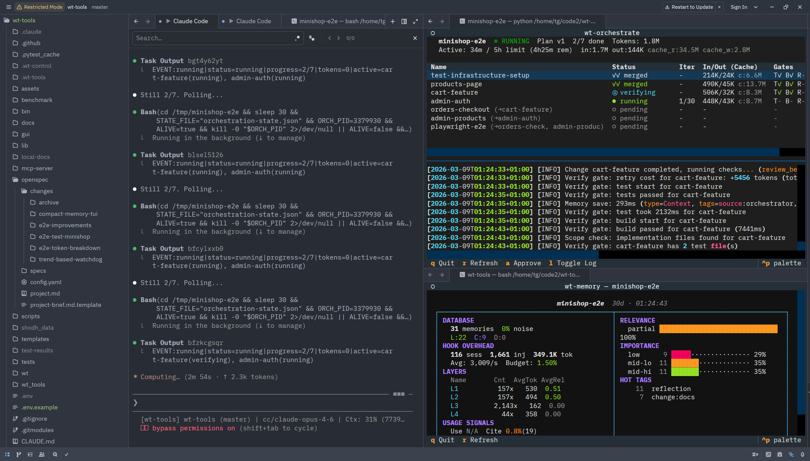

# wt-tools

**Autonomous multi-agent orchestration for Claude Code** — give it a spec, get merged features.

[](LICENSE)
[]()

---

## Why wt-tools?

Claude Code is already incredibly powerful. wt-tools asks: *how far can we push it?*

You have a spec with 10 features. Hand it to wt-tools — parallel agents decompose, implement, test, and merge all of them while you sleep. Some of these capabilities will eventually land in Claude Code natively (like Agent Teams). We're exploring the frontier now, learning what works in production, and sharing the patterns.

**wt-tools is a full autonomous pipeline:**

```
spec.md ──► decompose ──► parallel agents ──► merge ──► done
```

<details>
<summary>What's actually happening under the hood</summary>

```
spec.md
  │
  ▼
┌─────────────────────────────────────────────────────┐
│ Sentinel                                            │
│  ├─ decomposes spec into independent changes        │
│  ├─ dispatches each to its own git worktree         │
│  ├─ monitors progress, restarts on crash            │
│  └─ merges verified results back to main            │
│                                                     │
│  Per change:                                        │
│  ┌────────────────────────────────────────────┐     │
│  │ Ralph Loop                                 │     │
│  │  ├─ OpenSpec artifacts (design → tasks)     │     │
│  │  ├─ iterative implementation with tests     │     │
│  │  ├─ progress-based trend detection          │     │
│  │  └─ auto-pause on stall or budget limit     │     │
│  └────────────────────────────────────────────┘     │
│                                                     │
│  Across all agents:                                 │
│  ┌────────────────────────────────────────────┐     │
│  │ Memory Layer                               │     │
│  │  ├─ 5-layer hooks inject context per tool   │     │
│  │  ├─ agents learn from each other's work     │     │
│  │  └─ conventions survive across sessions     │     │
│  └────────────────────────────────────────────┘     │
└─────────────────────────────────────────────────────┘
  │
  ▼
merged, tested, done
```

</details>

### What we've learned pushing the limits

| Capability | What wt-tools adds |
|---|---|
| **Full pipeline** | Spec → decompose → parallel dispatch → verify → merge — hands-off |
| **Persistent memory** | Cross-session semantic recall — agents learn from each other (+34% convention compliance) |
| **Structured workflow** | OpenSpec: proposal → design → spec → tasks → code — keeps agents on track |
| **Autonomous supervision** | Sentinel: crash recovery, progress monitoring, auto-restart |
| **Zero infrastructure** | File-based, no daemon, no database, no external service |

---

## Quick Start

```bash
# Install
git clone https://github.com/tatargabor/wt-tools.git
cd wt-tools && ./install.sh

# Register your project
cd ~/my-project && wt-project init

# Run autonomous orchestration (from a Claude Code session)
/wt:sentinel --spec docs/my-spec.md --max-parallel 2
```

Or start simple — just use worktrees:

```bash
wt-new my-feature        # create isolated worktree
wt-work my-feature       # open in editor + start Claude Code
# ... work ...
wt-merge my-feature      # merge back to main
```

See [Getting Started](docs/getting-started.md) for the full guide.

---

## Core Features

**[Sentinel & Orchestration](docs/sentinel.md)** — Decomposes a spec into independent changes, dispatches each to its own worktree, monitors progress, merges with verification gates. The sentinel handles crashes, auto-approves, and summarizes. [Details](docs/orchestration.md)

**[Developer Memory](docs/developer-memory.md)** — Per-project semantic recall. Agents save decisions and learnings as they work; future agents recall them automatically via 5-layer hooks (+34% convention compliance in benchmarks).

**[OpenSpec Workflow](docs/openspec.md)** — Structured spec-driven development: `/opsx:new` → `/opsx:ff` → `/opsx:apply` → `/opsx:verify` → `/opsx:archive`. Prevents agents from going off-track with artifact tracking.

**[Worktrees](docs/worktrees.md)** — Git worktree lifecycle with editor integration and Claude Code auto-launch. CLI (`wt-new`, `wt-work`, `wt-merge`) or agent skills (`/wt:new`, `/wt:merge`).

**[Ralph Loop](docs/ralph.md)** — Autonomous agent execution. Runs Claude Code in iterations through task lists with configurable limits and progress-based trend detection.

**[Control Center GUI](docs/gui.md)** — Compact always-on-top window: agent status, context %, API burn rate, Ralph progress, orchestration state.

**[Team Sync](docs/team-sync.md) · [MCP Server](docs/mcp-server.md)** — Cross-machine coordination via `wt-control` git branch. MCP server exposes worktree status, memory tools, and Ralph progress to agents.

### When to use what

| Situation | Tool |
|---|---|
| Single agent, single project | Claude Code alone is great — start there |
| 2+ agents or switching projects | Control Center GUI + `wt-work` |
| Structured feature development | OpenSpec (`/opsx:new` → `/opsx:apply`) |
| Task list to grind through | Ralph Loop (`wt-loop start`) |
| Multiple changes from a spec | Sentinel (`/wt:sentinel --spec`) |
| Agents learning across sessions | Developer Memory (`wt-memory`) |

---



## Benchmark: What does autonomous orchestration look like?

We run a repeatable benchmark: build a **Next.js webshop from a single spec file** — products, cart, checkout, admin auth, admin CRUD — with zero human intervention.

**Run #4 results** (the latest):

```
Spec ──► 6 changes planned ──► parallel agents ──► all 6 merged ──► done

Wall clock:        1h 45m
Human interventions: 0
Merge conflicts:     0
Jest unit tests:    38 (6 suites)
Playwright E2E:     32 (6 spec files)
Source files:       47 TypeScript/TSX
Verify retries:     5 (all self-healed)
```

```
22:06          22:30     22:46          23:04    23:13              23:51
  │              │         │              │        │                  │
  ├─ Plan (3m)   │         │              │        │                  │
  ├─ Infra ──────┤ 19m     │              │        │                  │
  │              ├─ Prods ─┤ 12m          │        │                  │
  │              │         ├─ Cart ───────┤ 16m    │                  │
  │              │         ├─ Auth ───────┼────────┤ 26m              │
  │              │         │              ├─ Orders┤ 18m              │
  │              │         │              │        ├─ Admin Products ─┤ 36m
  │              │         │              │        │                  │
  done           done      │         2 parallel    │            2 parallel
                           │              │        │                  │
```

Every change passes: **Jest → Build → Playwright E2E → OpenSpec verify → Merge → Post-merge smoke.**

Full details with quality gate breakdown, retry analysis, and run-over-run comparison: **[Benchmark Report](docs/benchmark-minishop-run4.md)**

---

## Fork & Adapt

Our primary focus is web development — that's where we push hardest. But wt-tools is project-agnostic by design. The base tooling (worktrees, memory, orchestration) works on any codebase: APIs, mobile apps, data pipelines, research projects. Built from months of production work across web apps, sensor systems, education platforms, and more.

**Why fork or study it:**
- Battle-tested orchestration patterns from real client projects
- 40+ archived OpenSpec changes showing real development history
- Modular — cherry-pick what you need (CLI, memory, orchestration, GUI)
- Well-structured `.claude/` setup (hooks, skills, commands, agents) ready to adapt
- Continuously updated as Claude Code's capabilities expand

Built and used in production by [ITLine Kft.](https://itline.hu) and [Zengo Kft.](https://zengo.eu).

### On the horizon

Claude Code is evolving fast — Agent Teams, persistent memory, and better autonomous loops are all coming. We're not racing against these; we're exploring ahead of them. When they land natively, we'll integrate or retire gracefully. The patterns and production learnings remain valuable either way.

---

## Installation

**Prerequisites:** Git, Python 3.10+, jq, Node.js

```bash
git clone https://github.com/tatargabor/wt-tools.git
cd wt-tools && ./install.sh
```

The installer handles everything: CLI symlinks, shell completions, MCP server config, GUI dependencies, and optional memory system setup. See [Getting Started](docs/getting-started.md) for platform-specific notes.

### Platform & Editor Support

| Platform / Tool | Status |
|---|---|
| **Linux** | Primary — tested on Ubuntu 22.04+ |
| **macOS** | Supported |
| **Zed** | Primary editor, best tested |
| **VS Code / Cursor / Windsurf** | Supported via `wt-config editor set` |
| **Claude Code** | Integrated — auto-launch, MCP, skill hooks |

---

## Project Types & Convention Plugins

When multiple agents work on a codebase, they need shared conventions — not copied into CLAUDE.md (which wastes context every turn), but loaded on demand when relevant files are touched.

**Project type plugins** solve this:

```
wt-project-base          Universal rules (file size, secrets, TODOs)
  └── wt-project-web      Web domain rules (SEO, a11y, security, i18n, ...)
        └── your-org-web   Organization-specific rules
```

```bash
wt-project init --project-type web --template nextjs
```

This deploys path-scoped convention files, verification rules, and orchestration directives into the project. Agents only see the rules relevant to the files they're editing — an agent working on `prisma/schema.prisma` gets data-model conventions, not UI rules.

Available project types:
- **[wt-project-base](https://github.com/tatargabor/wt-project-base)** — universal rules for any codebase
- **[wt-project-web](https://github.com/tatargabor/wt-project-web)** — 12 convention areas, 11 verification rules, 7 orchestration directives for modern web apps

See [Plugin Architecture](https://github.com/tatargabor/wt-project-web/blob/master/docs/plugin-architecture.md) for customization and layering.

## Plugins

wt-tools is extensible via plugins — separate repositories that add skills, agents, hooks, or CLI commands. Plugins deploy to a project's `.claude/` directory alongside core files. See [Plugins](docs/plugins.md).

---

## Docs

[Getting Started](docs/getting-started.md) · [Sentinel](docs/sentinel.md) · [Orchestration](docs/orchestration.md) · [OpenSpec](docs/openspec.md) · [Worktrees](docs/worktrees.md) · [Ralph Loop](docs/ralph.md) · [Memory](docs/developer-memory.md) · [GUI](docs/gui.md) · [Team Sync](docs/team-sync.md) · [MCP Server](docs/mcp-server.md) · [CLI Reference](docs/cli-reference.md) · [Configuration](docs/configuration.md) · [Architecture](docs/architecture.md)

---

<details>
<summary><strong>Alternatives & Comparison</strong></summary>

The Claude Code multi-agent space is evolving fast. Tools fall into three categories:

**Session managers** — run N agents, switch between them (claude-squad, agent-deck)
**Plugins/enhancements** — make Claude Code smarter from within (oh-my-claudecode, wshobson/agents)
**Spec-driven orchestrators** — decompose work, dispatch, verify, merge (wt-tools, ccpm, overstory)

Note: Claude Code's native Agent Teams (experimental) is moving fast — many wt-tools patterns will likely become built-in. We see this as validation, not competition. The value is in what we've learned building production orchestration, and this repo shares those patterns openly.

| Tool | Stars | Category | Focus |
|---|---|---|---|
| [ruflo](https://github.com/ruvnet/ruflo) | ~20k | Platform | Enterprise swarm platform, 60+ agents, MCP |
| [oh-my-claudecode](https://github.com/Yeachan-Heo/oh-my-claudecode) | ~8.5k | Plugin | 5 execution modes, 32 agents, auto-resume |
| [ccpm](https://github.com/automazeio/ccpm) | ~7.6k | Orchestrator | GitHub Issues as task DB, spec-driven |
| [claude-squad](https://github.com/smtg-ai/claude-squad) | ~6.2k | Session mgr | TUI for tmux+worktree sessions (Go) |
| [agent-orchestrator](https://github.com/ComposioHQ/agent-orchestrator) | ~3.9k | Orchestrator | Agent-agnostic, runtime-agnostic |
| [automaker](https://github.com/AutoMaker-Org/automaker) | ~3k | Desktop app | Electron Kanban + Claude Agent SDK |
| [agent-deck](https://github.com/asheshgoplani/agent-deck) | ~1.4k | Session mgr | TUI+Web, session forking, MCP pooling |
| [overstory](https://github.com/jayminwest/overstory) | ~290 | Orchestrator | Runtime-agnostic, SQLite messaging, FIFO merge |

### Feature comparison

```
                     Spec→Merge  Worktree  Auto   Memory  Structured   Crash    GUI
                     Pipeline    Isolation Loop   Recall  Workflow     Recovery
────────────────────────────────────────────────────────────────────────────────────
wt-tools              Y          Y        Y      Y       Y (OpenSpec)  Y        Y
ccpm                  Y          Y        Y      -       Y (PRD→Issue) -        -
oh-my-claudecode      -          -        Y      -       -             Y        -
claude-squad          -          Y        Y      -       -             -       TUI
agent-orchestrator    Y          Y        ~      -       -             -        -
automaker             Y          Y        Y      -       -             -        Y
overstory             ~          Y        Y      -       -             Y       TUI
```

**wt-tools is the only tool combining full spec-to-merge pipeline, persistent cross-session memory, and structured spec workflow.** Closest competitor is ccpm (spec-driven, parallel agents) but it requires GitHub Issues as its task store and lacks memory and sentinel supervision.

</details>

---

## Contributing

See [CONTRIBUTING.md](CONTRIBUTING.md) for development setup and pull request guidelines.

## Acknowledgements

Built by [Gabor Tatar](https://itline.hu) (ITLine Kft.) and used across production projects. Collaboration partners: [BlackBelt](https://blackbelt.hu) · [AIOrigo](https://aiorigo.com) · [MKIK](https://mkik.hu). Special thanks to [Zengo Kft.](https://zengo.eu).

## License

MIT — See [LICENSE](LICENSE) for details.
