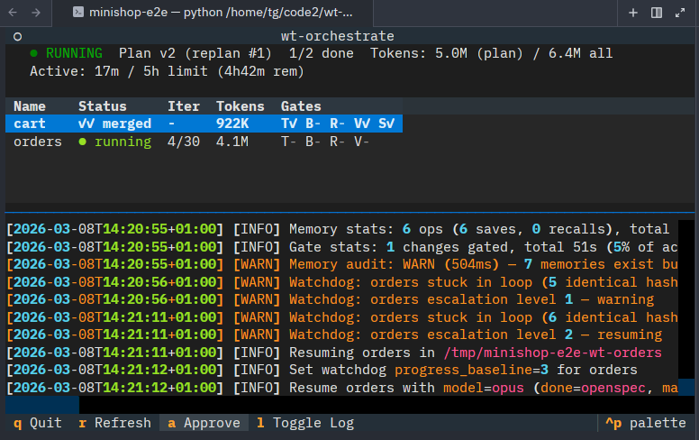

# wt-tools

**Autonomous multi-agent orchestration for Claude Code** — give it a spec, get merged features.

[](LICENSE)
[]()

---

## Why wt-tools?

You have a spec with 10 features. You could implement them one by one. Or you could hand the spec to wt-tools and let parallel Claude Code agents implement, test, and merge all of them — while you sleep.

**The problem:** Claude Code is powerful but single-threaded. Running multiple agents means managing worktrees, tracking progress, handling crashes, and merging results manually.

**wt-tools solves this** with an end-to-end pipeline:

```
spec.md ──► decompose ──► parallel worktrees ──► verify & merge ──► done
               │              │        │
           sentinel      Ralph loops  memory
           supervises     per change   recall
```



### What makes it different

| | wt-tools | Most alternatives |
|---|---|---|
| **Pipeline** | Full spec → merge (decompose, dispatch, verify, merge) | Session management only |
| **Memory** | Persistent cross-session recall (+34% convention compliance) | No memory or basic logs |
| **Workflow** | OpenSpec: structured proposal → design → spec → tasks → code | Ad-hoc prompts |
| **Supervision** | Sentinel: auto-restart, crash recovery, progress monitoring | Manual monitoring |
| **Architecture** | File-based, no daemon, no database, no external service | Often requires servers |

---

## Quick Start

```bash
# Install
git clone https://github.com/tatargabor/wt-tools.git
cd wt-tools && ./install.sh

# Register your project
cd ~/my-project && wt-project init

# Run autonomous orchestration (from a Claude Code session)
/wt:sentinel --spec docs/my-spec.md --max-parallel 2
```

Or start simple — just use worktrees:

```bash
wt-new my-feature        # create isolated worktree
wt-work my-feature       # open in editor + start Claude Code
# ... work ...
wt-merge my-feature      # merge back to main
```

See [Getting Started](docs/getting-started.md) for the full guide.

---

## Core Features

**[Sentinel & Orchestration](docs/sentinel.md)** — Decomposes a spec into independent changes, dispatches each to its own worktree, monitors progress, merges with verification gates. The sentinel handles crashes, auto-approves, and summarizes. [Details](docs/orchestration.md)

**[Developer Memory](docs/developer-memory.md)** — Per-project semantic recall. Agents save decisions and learnings as they work; future agents recall them automatically via 5-layer hooks (+34% convention compliance in benchmarks).

**[OpenSpec Workflow](docs/openspec.md)** — Structured spec-driven development: `/opsx:new` → `/opsx:ff` → `/opsx:apply` → `/opsx:verify` → `/opsx:archive`. Prevents agents from going off-track with artifact tracking.

**[Worktrees](docs/worktrees.md)** — Git worktree lifecycle with editor integration and Claude Code auto-launch. CLI (`wt-new`, `wt-work`, `wt-merge`) or agent skills (`/wt:new`, `/wt:merge`).

**[Ralph Loop](docs/ralph.md)** — Autonomous agent execution. Runs Claude Code in iterations through task lists with configurable limits and progress-based trend detection.

**[Control Center GUI](docs/gui.md)** — Compact always-on-top window: agent status, context %, API burn rate, Ralph progress, orchestration state.

**[Team Sync](docs/team-sync.md) · [MCP Server](docs/mcp-server.md)** — Cross-machine coordination via `wt-control` git branch. MCP server exposes worktree status, memory tools, and Ralph progress to agents.

### When to use what

| Situation | Tool |
|---|---|
| Single agent, single project | You probably don't need wt-tools yet |
| 2+ agents or switching projects | Control Center GUI + `wt-work` |
| Structured feature development | OpenSpec (`/opsx:new` → `/opsx:apply`) |
| Task list to grind through | Ralph Loop (`wt-loop start`) |
| Multiple changes from a spec | Sentinel (`/wt:sentinel --spec`) |
| Agents learning across sessions | Developer Memory (`wt-memory`) |

---

## Fork & Adapt

wt-tools is **not a weekend experiment**. It's built from months of real production work across web apps, research projects, sensor systems, education platforms, and mobile apps on Linux and macOS. Every feature is battle-tested on client projects and continuously updated.

**Why fork or copy from it:**
- Production-tested orchestration patterns you won't find elsewhere
- 40+ OpenSpec archived changes showing real development history
- Modular — cherry-pick what you need (CLI, memory, orchestration, GUI)
- Well-structured `.claude/` setup (hooks, skills, commands, agents) ready to adapt
- Actively maintained with latest Claude Code patterns

Built and used in production by [ITLine Kft.](https://itline.hu) and [Zengo Kft.](https://zengo.eu).

---

## Installation

**Prerequisites:** Git, Python 3.10+, jq, Node.js

```bash
git clone https://github.com/tatargabor/wt-tools.git
cd wt-tools && ./install.sh
```

The installer handles everything: CLI symlinks, shell completions, MCP server config, GUI dependencies, and optional memory system setup. See [Getting Started](docs/getting-started.md) for platform-specific notes.

### Platform & Editor Support

| Platform / Tool | Status |
|---|---|
| **Linux** | Primary — tested on Ubuntu 22.04+ |
| **macOS** | Supported |
| **Zed** | Primary editor, best tested |
| **VS Code / Cursor / Windsurf** | Supported via `wt-config editor set` |
| **Claude Code** | Integrated — auto-launch, MCP, skill hooks |

---

## Plugins

wt-tools is extensible via plugins — separate repositories that add skills, agents, hooks, or CLI commands. Plugins deploy to a project's `.claude/` directory alongside core files. See [Plugins](docs/plugins.md).

---

## Docs

[Getting Started](docs/getting-started.md) · [Sentinel](docs/sentinel.md) · [Orchestration](docs/orchestration.md) · [OpenSpec](docs/openspec.md) · [Worktrees](docs/worktrees.md) · [Ralph Loop](docs/ralph.md) · [Memory](docs/developer-memory.md) · [GUI](docs/gui.md) · [Team Sync](docs/team-sync.md) · [MCP Server](docs/mcp-server.md) · [CLI Reference](docs/cli-reference.md) · [Configuration](docs/configuration.md) · [Architecture](docs/architecture.md)

---

<details>
<summary><strong>Alternatives & Comparison</strong></summary>

The Claude Code multi-agent space is evolving fast. Tools fall into three categories:

**Session managers** — run N agents, switch between them (claude-squad, agent-deck)
**Plugins/enhancements** — make Claude Code smarter from within (oh-my-claudecode, wshobson/agents)
**Spec-driven orchestrators** — decompose work, dispatch, verify, merge (wt-tools, ccpm, overstory)

Note: Claude Code's native Agent Teams feature (experimental) handles basic multi-agent coordination within a single worktree. wt-tools orchestrates *across* worktrees with spec decomposition, verification gates, and persistent memory.

| Tool | Stars | Category | Focus |
|---|---|---|---|
| [ruflo](https://github.com/ruvnet/ruflo) | ~20k | Platform | Enterprise swarm platform, 60+ agents, MCP |
| [oh-my-claudecode](https://github.com/Yeachan-Heo/oh-my-claudecode) | ~8.5k | Plugin | 5 execution modes, 32 agents, auto-resume |
| [ccpm](https://github.com/automazeio/ccpm) | ~7.6k | Orchestrator | GitHub Issues as task DB, spec-driven |
| [claude-squad](https://github.com/smtg-ai/claude-squad) | ~6.2k | Session mgr | TUI for tmux+worktree sessions (Go) |
| [agent-orchestrator](https://github.com/ComposioHQ/agent-orchestrator) | ~3.9k | Orchestrator | Agent-agnostic, runtime-agnostic |
| [automaker](https://github.com/AutoMaker-Org/automaker) | ~3k | Desktop app | Electron Kanban + Claude Agent SDK |
| [agent-deck](https://github.com/asheshgoplani/agent-deck) | ~1.4k | Session mgr | TUI+Web, session forking, MCP pooling |
| [overstory](https://github.com/jayminwest/overstory) | ~290 | Orchestrator | Runtime-agnostic, SQLite messaging, FIFO merge |

### Feature comparison

```
                     Spec→Merge  Worktree  Auto   Memory  Structured   Crash    GUI
                     Pipeline    Isolation Loop   Recall  Workflow     Recovery
────────────────────────────────────────────────────────────────────────────────────
wt-tools              Y          Y        Y      Y       Y (OpenSpec)  Y        Y
ccpm                  Y          Y        Y      -       Y (PRD→Issue) -        -
oh-my-claudecode      -          -        Y      -       -             Y        -
claude-squad          -          Y        Y      -       -             -       TUI
agent-orchestrator    Y          Y        ~      -       -             -        -
automaker             Y          Y        Y      -       -             -        Y
overstory             ~          Y        Y      -       -             Y       TUI
```

**wt-tools is the only tool combining full spec-to-merge pipeline, persistent cross-session memory, and structured spec workflow.** Closest competitor is ccpm (spec-driven, parallel agents) but it requires GitHub Issues as its task store and lacks memory and sentinel supervision.

</details>

---

## Contributing

See [CONTRIBUTING.md](CONTRIBUTING.md) for development setup and pull request guidelines.

## Acknowledgements

Built and used in production by [ITLine Kft.](https://itline.hu) and [Zengo Kft.](https://zengo.eu). Collaboration partners: [BlackBelt](https://blackbelt.hu) · [AIOrigo](https://aiorigo.com) · [MKIK](https://mkik.hu).

## License

MIT — See [LICENSE](LICENSE) for details.
