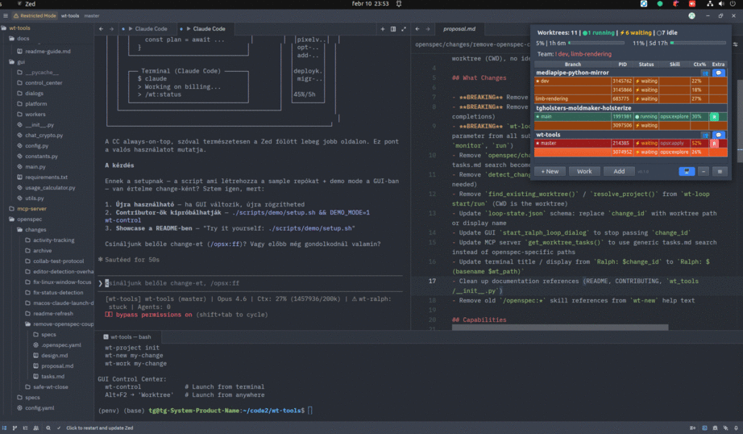
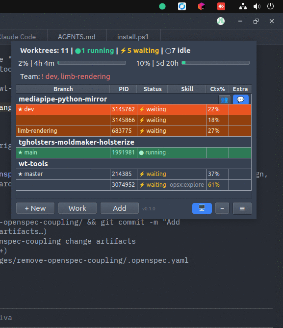

[< Back to README](../README.md)

# Control Center GUI

Always-on-top PySide6 window showing all worktrees and agent status across all your projects. Compact, draggable, and designed to stay visible alongside your editor.



## What It Shows

- **Agent status per worktree**: running / waiting / idle — with the active Claude Code skill name
- **Context usage**: how full each agent's context window is (%)
- **API burn rate**: hourly and daily token usage with visual bars
- **Ralph Loop progress**: iteration count and task completion for autonomous runs
- **Orchestration status**: when `wt-orchestrate` is running, dispatched changes and merge progress
- **Team members**: what other machines/agents are working on (if Team Sync is enabled)
- **Status badges**: per-project indicators — **M** (memory available), **O** (OpenSpec initialized), **R** (Ralph loop running)



## Interaction

| Action | What happens |
|--------|-------------|
| **Double-click row** | Opens editor + focuses the worktree window |
| **Blinking red row** | Agent is waiting for your input — click to jump there |
| **Right-click row** | Context menu: merge, close, start Ralph loop, and more |
| **"+ New" button** | Create a new worktree (pick project, name the change) |
| **System tray icon** | Minimize to tray, restore with click |

## Why the GUI?

You're working on 3 projects. Each has 1-2 worktrees with Claude agents running. That's 5-6 terminal tabs, and you keep losing track of which agent is waiting for input, which one finished, and which one ate 80% of its context.

```
┌──────────────────────────────────────────────────────────┐
│  Worktrees: 6 | 2 waiting | 1 running | 3 idle           │
├──────────────────────────────────────────────────────────┤
│  my-app     │ add-auth    │ waiting  │ 45%               │
│             │ fix-api     │ running  │ 72%               │
│  my-lib     │ refactor    │ waiting  │ 80%  <- high!     │
│  docs-site  │ redesign    │ idle     │                   │
└──────────────────────────────────────────────────────────┘
```

- Yellow/blinking row = agent needs your input
- Context % tells you which agent is running low
- API usage bar shows remaining capacity
- No tab hunting, no `ps aux | grep claude`

## Configuration

GUI settings are in `~/.config/wt-tools/gui-config.json`:

```json
{
  "control_center": {
    "opacity_default": 0.5,
    "opacity_hover": 1.0,
    "window_width": 500,
    "refresh_interval_ms": 2000,
    "blink_interval_ms": 500,
    "color_profile": "light"
  }
}
```

### Color Profiles

| Profile | Description |
|---------|-------------|
| `light` | Light background, dark text (default) |
| `dark` | Dark background, light text |
| `high_contrast` | Maximum contrast |

Selectable in Settings dialog or by editing `gui-config.json`.

### Memory Browser

**Menu > Memory > Browse Memories...**

Opens a dialog with two views:
- **Summary mode** (default) — context summary grouped by category (Decisions, Learnings, Context)
- **List mode** — paginated card list showing all memories, 50 at a time

Features: semantic search, export/import buttons, "Remember Note" for quick saves.

## Launch

```bash
wt-control          # launch GUI
wt-control-gui      # alternative launcher
```

The GUI is optional — all functionality is available via CLI and Claude Code skills.

---

*See also: [Getting Started](getting-started.md) · [Worktree Management](worktrees.md) · [Configuration](configuration.md)*
